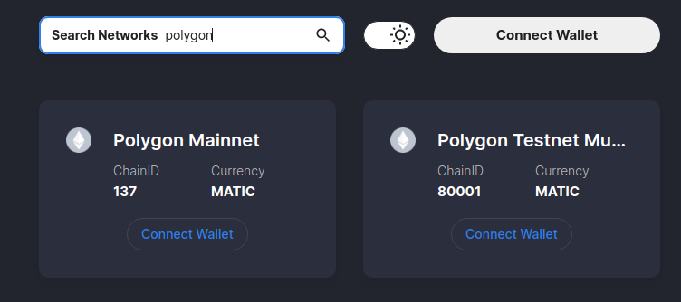
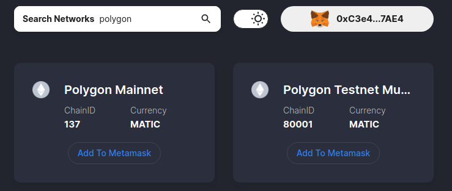
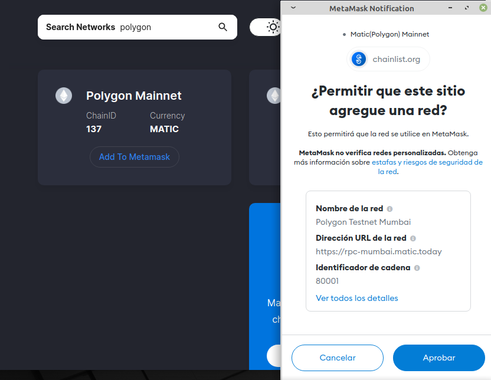
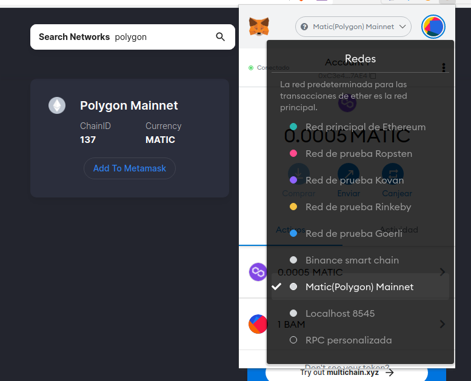
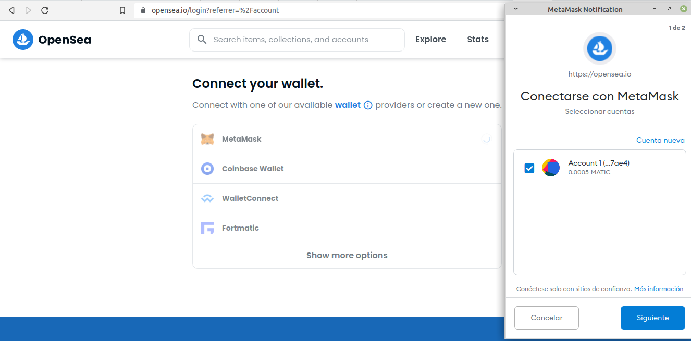

# TallerNTF
Taller 28 de octubre / Platohedro 

Lo primero que debemos de tener es el archivo que vamos a mintear ya sea jpg png gif svg webm wav gbl gtlf mp4 mp3 | max size 100mb 

## Metamask 

Creamos una wallet en este paso debemos de TENER EN CUENTA LA SED O 12 PALABRAS! es nuestra llave para volver a acceder a metamask 

Descargamos y agregamos metamask como una extensión del navegador 

Abrir wallet en [Metamask](https://metamask.io/)  

## Polygon adherido a metamask

Que es [polygon](https://www.polygon.com/)

 conectar red a [chainlist](https://chainlist.org/) 
 
 
 buscando red de polygon-matic

 
 
 wallet conectada a chainlist.
 
 
 
 aprobar la red de polygon-matic en la metqamask.
 
 
 
 la red polygon-matic queda añadida a la metamask y queda visualizada.
 
 

## Opensea

Con la wallet de metamask nos logeamos a [Opensea](https://opensea.io/)

 

## Mintear

1. Para comenzar iremos a la página principal de open sea donde encontraremos el siguiente mensaje, allí haremos clic en el botón que dice "create".

___

2. El anterior botón nos llevará al menú de creación en donde comenzaremos cargando el archivo que deseamos subir y asignando un nombre.

- El nombre no podrá ser cambiado
- Para cargar el archivo podemos arrastrar y soltar o hacer clic en el cuadro gris y esto nos abrirá un menú de carga
- Este archivo será guardado por opensea en ipfs y a partir de este se generará la firma digital que será incluída en el nft.

___

3. Al bajar un poco más encontraremos algunas piezas de metada que podremos cargar.

- External link: puede ser un link a tu portafolio o algún lugar donde también hayas cargado la pieza.

- Description: un espacio para contar más sobre tu pieza.

- Collection: este es un espacio para asociar tu nft a alguna colección existente, al ser nuestro primer nft no tocaremos este espacio (más adelante crearemos la colección y agregaremos esta pieza)

__

4. En esta sección tenemos 3 espacios para ingresar rasgos sobre nuestro nft, suelen ser usadas en series de nfts coleccionables, en el caso del arte podemos no usarlas.

Muy importante:
- Unlockable content: Una pequeña caja de texto que sólo se revelará a la persona que posea el nft, es común poner enlaces a grupos privados de fans o coleccionistas
- Explicit content: Una advertencia en caso de que tu contenido incluya escenas eróticas o violentas (una cláusula de opensea que no necesariamente hace parte del mundo nft)

___

5. En esta última sección veremos la cantidad de ejemplares y la red donde será minteada la pieza.

- Supply: es la cantidad de ejemplares, dejamos en 1 para sólo vender "el original" o aumentar el número para tener varias copias equivalentes (token semi fungible). En el caso de ethereum, esta opción estará desabilitada por defecto y tendremos que ir al [discord de opensea](https://discord.com/invite/opensea) para solicitar soporte.

- Blockchain: Acá elegiremos entre Ethereum o Polygon, la cadena donde se registrará nuestro token, en el caso de Polygon tenemos la ventaja de mintear gratuitamente (sin pagar gas) y poder emitir múltiples ejemplares.

Una vez habiendo elegido todas las opciones podemos hacer clic en el botón de "crear", luego se abrirá una ventana de metamask donde firmaremos la transacción minteando así nuestro primer NFT

___

## Listar

## Crear colección

# Añadir a colección

# Regalar

